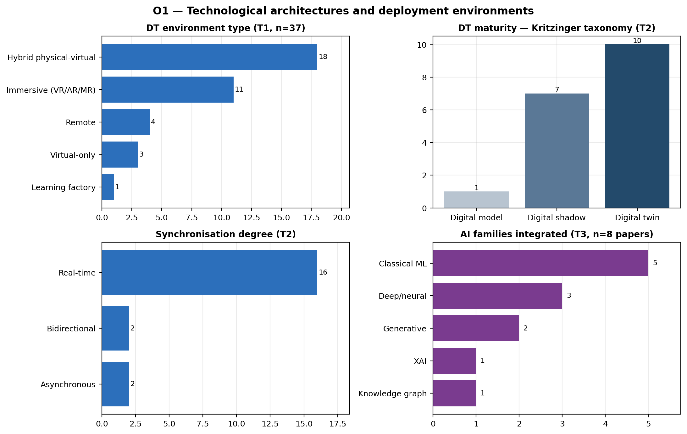
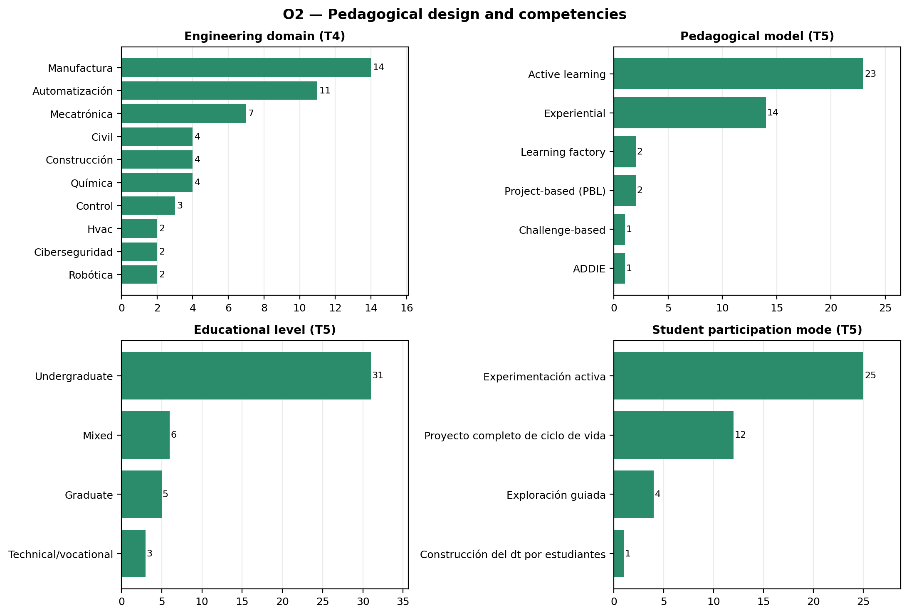
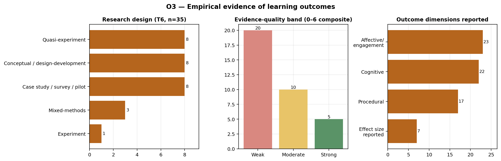
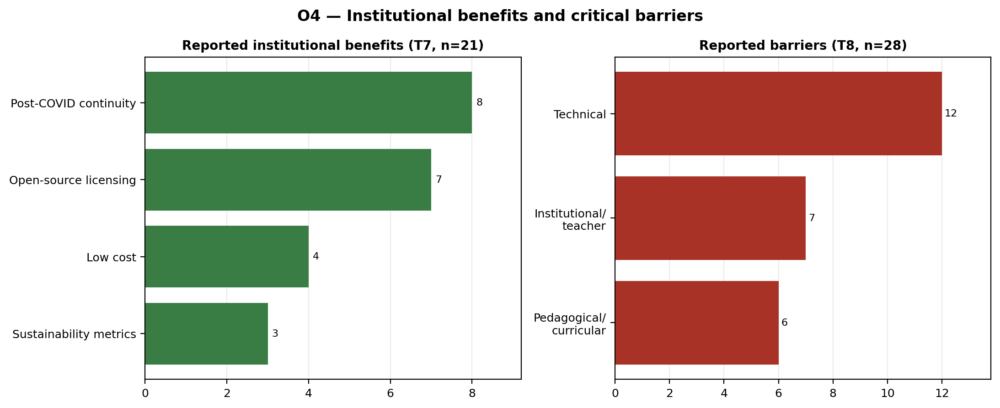
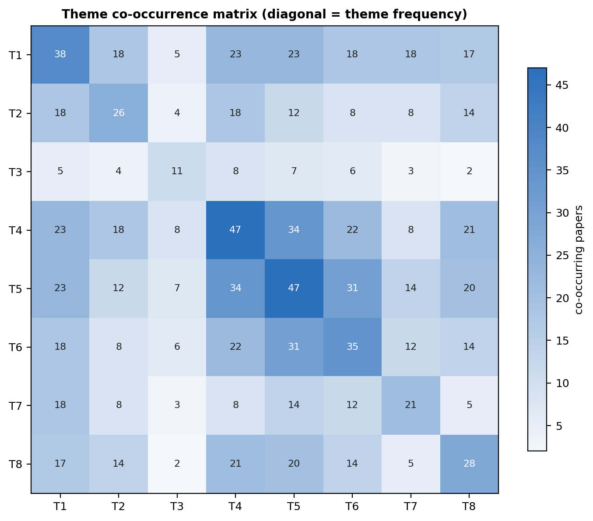
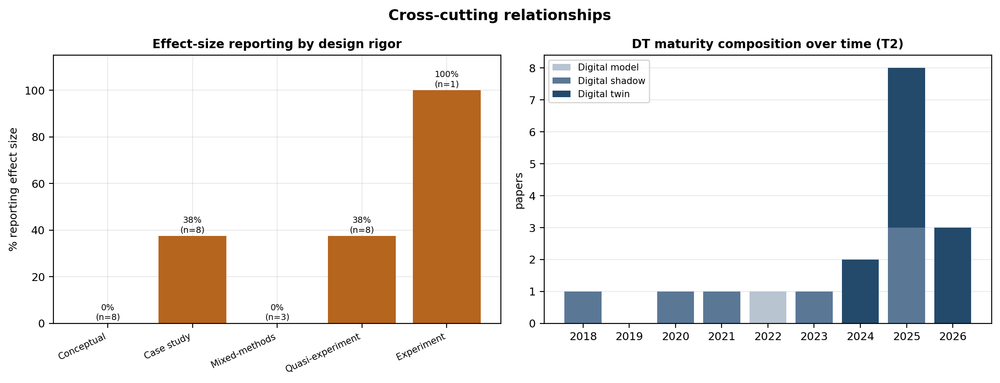
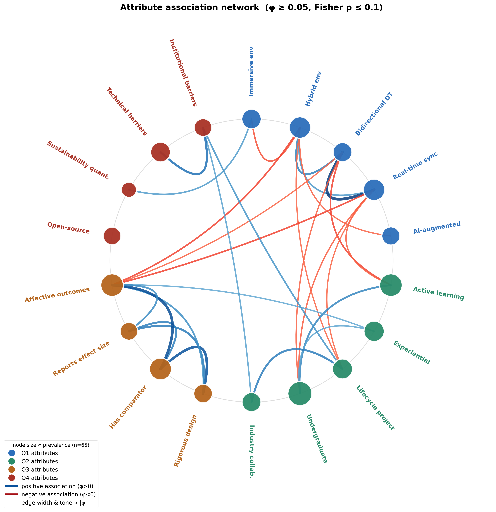
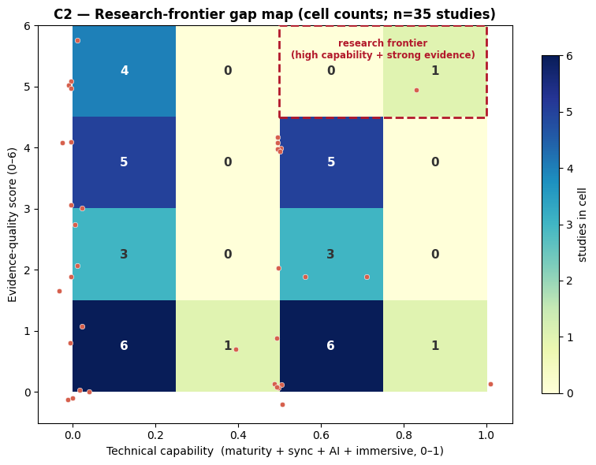
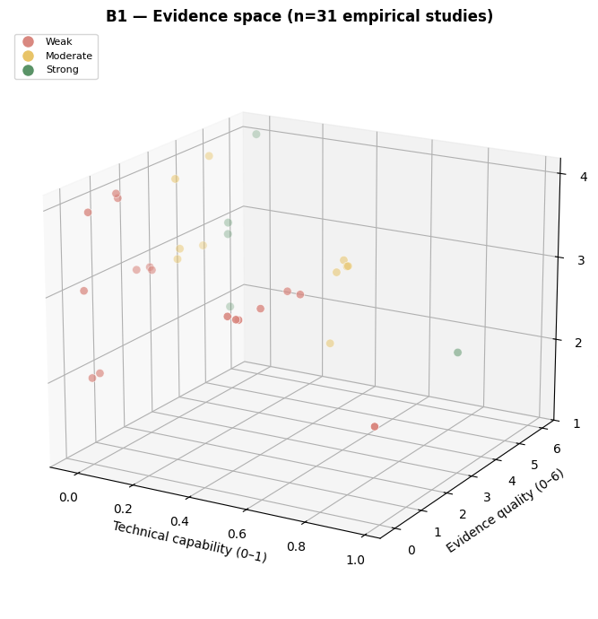
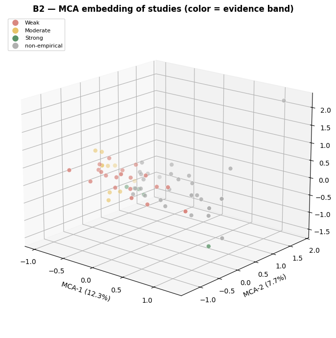

# Results

This section reports the synthesis of 65 primary studies on digital twins (DTs)
in engineering education. Following the review design, the analysis proceeds in
three layers — descriptive profiling per theme (Layer 1), aggregation by review
objective (Layer 2), and cross-cutting co-occurrence and relational analysis
(Layer 3/4) — mapped onto the four objectives O1–O4. Counts are reported over
the subset of studies that activated each theme; reporting rates (the share of
those studies that actually documented a given variable, as opposed to "not
reported", NR) are stated explicitly because they bound the strength of every
claim that follows. All supporting tables and figures (Figures 2–11; Tables 1
and 2) are produced by a reproducible analysis pipeline.

## Corpus overview

The corpus spans 2018–2026 and is recent: 39 of 65 studies (60%) were published
in 2025–2026, with 26 in 2025 and 13 in 2026. Journal articles (37) and
conference papers (26) are represented in comparable numbers. Studies are
unevenly distributed across the eight inductive themes: pedagogy (T5, n=47) and
Industry 4.0/5.0 competencies (T4, n=47) are most frequent, followed by
practical infrastructure (T1, n=38), empirical evidence (T6, n=35), barriers
(T8, n=28), enabling architectures (T2, n=26), institutional value (T7, n=21)
and AI convergence (T3, n=11). Most studies activated three (19) or four (28)
themes, indicating that individual papers typically address technology,
pedagogy and outcomes jointly rather than in isolation.

## O1 — Technological architectures and deployment environments (T1+T2+T3)

**Deployment environment (T1).** The environment type was reported in 37 of 38
studies (97%). Hybrid physical–virtual setups are the most common configuration
(18), followed by immersive VR/AR/MR environments (11), remote (4) and
virtual-only (3). The modelled physical system was almost always specified
(95%), most often a manufacturing plant or production line, with isolated cases
in metallurgy, instrumentation laboratories, HVAC and robotics. Two variables
were comparatively under-reported: the access modality (37%) and the immersive
hardware/software stack (55%), where Unity is the recurring engine and head-set
hardware (e.g., Oculus Rift) appears only sporadically. Reported visual/
functional fidelity (58%) was qualitatively "high" in 14 studies, but fidelity
was seldom quantified.

**Enabling architecture (T2).** Among the 26 architecture studies, physical
components, virtual components and communication protocols were each documented
in 88% of cases, whereas the layered architecture was described in 62%. OPC UA
is the most frequently named protocol, with MQTT, TCP/IP, EtherCAT, the Asset
Administration Shell (AAS) and the IEC 61131-3/61499 family also present. Mapped
onto the Kritzinger et al. taxonomy (reported by 18 of 26), the studies that
specify a category claim a fully bidirectional digital twin in 10 cases and a
(unidirectional) digital shadow in 7, with a single static digital model.
Synchronisation, where stated (20 of 26), is "real-time" (8) or "near-real-time"
(8); only one study documents automatic bidirectional control. These figures
should be read with caution: the taxonomy is largely self-described by authors
and rarely accompanied by latency or jitter measurements, so the prevalence of
"complete" twins likely reflects terminological usage more than verified
closed-loop synchronisation.

**AI convergence (T3).** AI is the least represented dimension (11 studies).
Where an AI family is named (8 of 11), it ranges across classical machine
learning, deep/neural networks, generative models (LLM/GAN), explainable AI and
knowledge graphs; the most common declared functions are prediction, diagnosis
and predictive maintenance, with a few cases of automated student feedback and
adaptive personalisation. Notably, AI performance metrics (accuracy, F1,
inference latency) were reported in only 3 of 11 studies (27%), so the
educational and technical performance of these AI components is largely
unverified in the current corpus.

{width=6in}

**Figure 2.** Technological architectures and deployment environments (Objective O1): category distributions and per-variable reporting rates for deployment environment, modelled system, enabling architecture and AI convergence. AR = augmented reality; MR = mixed reality; VR = virtual reality; AAS = Asset Administration Shell; AI = artificial intelligence; OPC UA = Open Platform Communications Unified Architecture.

## O2 — Pedagogical design and competencies (T4+T5)

**Disciplinary scope and competencies (T4).** The engineering domain was
reported in 46 of 47 studies (98%). Manufacturing (12) and automation (9)
dominate, but the corpus is disciplinarily diverse, also covering mechatronics
(5), chemical engineering (4), and smaller clusters in metallurgy, energy,
civil/construction, robotics and cybersecurity. Targeted competencies were
documented in 81% of studies and cluster around IIoT, smart manufacturing,
automation, data analytics and — increasingly — human–machine collaboration
framed as Industry 5.0. Two alignment variables are weak spots: explicit mapping
to industrial or accreditation standards (ABET, ISA-95, RAMI 4.0, IEC) and
documented industry–academia collaboration were each reported in only 21% of
studies. Competencies are therefore frequently *asserted as design intent*
rather than anchored to external frameworks or industry validation.

**Instructional design (T5).** The pedagogical model was reported in 43 of 47
studies (92%) and is overwhelmingly described as "active learning" (23) or
"experiential learning" (14); formally named approaches such as project-based
learning, learning/teaching factories, ADDIE or challenge-based learning are
individually rare. Interventions are concentrated at the undergraduate level
(31), and student participation is typically "active experimentation" (25) or a
"full life-cycle project" (12), with student *construction* of the twin itself
documented only once. The teacher is consistently positioned as a facilitator or
supervisor (reported in 77%). A recurring reporting gap is intervention
duration, stated in only 38% of studies, which limits any inference about dose
or sustained effects.

{width=6in}

**Figure 3.** Pedagogical design and Industry 4.0/5.0 competencies (Objective O2): engineering domains, targeted competencies, pedagogical models and participation modes, with reporting rates. IIoT = industrial Internet of Things.

## O3 — Empirical evidence of learning outcomes (T6)

Thirty-five studies activated T6. Research design was reported in 80% of them
and is mixed in rigour: quasi-experiments (8) and conceptual/design-development
studies (8) are equally common, alongside case studies/surveys/pilots (8),
mixed-methods (3) and a single controlled experiment. A comparator was described
in 83% of studies, but in 9 of these the "comparator" was in fact none, and only
a minority used a traditional-class control (8) or a within-subject pre/post
design (6). Across reported outcome dimensions, affective/engagement results
(23; spanning motivation, technology acceptance, self-efficacy and, where
NASA-TLX is used, cognitive load) and cognitive results (22) are reported more often than procedural skills
(17).

The central limitation of the evidence base concerns statistical reporting.
Inferential statistics with reported values appear in only 11 of 35 studies
(31%), and an effect size in only 7 (20%). To make this explicit, we scored
each empirical study on a 0–6 composite (design rigour, comparator, inferential
statistics, effect size, and declared validity threats). The resulting distribution is weighted toward
the lower end: 20 studies are *weak*, 10 *moderate* and 5 *strong* (median
composite score = 2 of 6). This bottom-heavy profile does not depend on the
chosen cut-points: under a stricter banding only 1 study is strong and under a
lenient banding 12 are, yet weak-or-moderate studies remain the clear majority
in every scheme (66–97%; 20 of 35 score ≤2 and are weak under all schemes).

Where strong studies exist, they report substantial effects. In a controlled
quasi-experiment on a digital-twin/IoT laboratory intervention, @kwateng_enhancing_2026 report a between-groups difference of t(198)=8.94, p<.001 with Cohen's
d=0.91, a
pre/post mean gain of +18.5 points in the intervention group versus +4.3 in the
control, and procedural improvements such as cloud-synchronisation success
rising from 68% to 92%; @wang_innovative_2025 report Cohen's d=1.24 for knowledge
mastery, @tarng_application_2024 an ANCOVA group effect of η²=0.50, and @lu_digital_2025 Cohen's d≈1.0 in algorithm-design and debugging tasks. These cases show
that rigorous evaluation of educational DTs is feasible, and the five strongest
studies are not small (N=60–140). They remain the exception, however: they are
mostly single-institution, non-randomised quasi-experiments with short, single-module
exposures and possible novelty effects — limitations the authors themselves
declare in 57% of T6 studies. Reported gains should therefore be read as
promising but not yet robustly generalisable.

{width=6in}

**Figure 4.** Empirical evidence of learning outcomes (Objective O3): research designs, comparators, reported outcome dimensions and the 0–6 evidence-quality composite. NASA-TLX = NASA Task Load Index.

## O4 — Institutional benefits and critical barriers (T7+T8)

**Institutional value (T7).** Among the 21 studies addressing institutional
value, accessibility and equity arguments are the most frequently articulated
(86%), predominantly framed as geographic remote access; the geographic context
of application was reported in all 21. However, the quantitative
underpinnings of the institutional case are thin: implementation cost was
reported in only 6 studies (29%), environmental-sustainability indicators in 3
(14%), and licensing model in 8 (38%, of which 6 open-source). The few studies
that do quantify these dimensions are informative: @bonavolonta_sustainability_2026
provide a life-cycle assessment of an immersive electronics laboratory
(≈7,000 kWh/year, ≈1.75 tCO₂/year, ≈200 kg of WEEE over seven years, and a
per-student cost roughly four times lower than the traditional laboratory, with
completion rising to 70% vs 56%), and @gallego_low-cost_2025 report a low-cost
VR-teleoperated robotic arm at under €400. Post-COVID continuity, a common
narrative motivation, is explicitly invoked in only 38% of these studies.

**Barriers (T8).** Twenty-eight studies discuss barriers, but reporting is again
partial. Technical barriers are the most frequently documented (43%) —
insufficient model fidelity, limited interoperability, latency/jitter,
synchronisation complexity and cybersecurity — while institutional/teacher
barriers (teacher training, curricular governance, resistance to change) and
pedagogical/curricular barriers (the virtual-to-physical transfer gap, limited
ecological validity, misalignment of competencies–activities–assessment) are
each documented in roughly a quarter of studies. Scalability or transferability
evidence was reported in 36%, usually as architectural argument rather than
demonstrated multi-institution replication. Declared facilitating conditions
(25%) converge on institutional commitment, industry partnerships, prior
training and minimum infrastructure.

{width=6in}

**Figure 5.** Institutional benefits and barriers (Objective O4): articulated benefits (accessibility, cost, sustainability, continuity) and reported barrier types (technical, institutional, pedagogical), with reporting rates. WEEE = waste electrical and electronic equipment.

## Cross-cutting analysis: co-occurrence, gaps and relationships

The co-occurrence matrix (Figure 6) shows that the corpus is organised around a
pedagogy–competencies–evidence core: the strongest theme pairings are T4–T5
(competencies × pedagogy, 34 studies) and T5–T6 (pedagogy × evidence, 31). AI
(T3) is weakly connected to every other theme (maximum co-occurrence of 8, with
T4). This structure motivates four configuration analyses that surface
relationships not visible in the per-theme frequencies:

- **Aspiration–evidence gap.** Twenty-five studies (38%) claim Industry 4.0/5.0
  competencies (T4) without activating empirical evaluation (T6), and 16 (25%)
  describe a pedagogical design (T5) with no empirical evidence. The competency
  claims of the field currently outpace its demonstrated learning outcomes.
- **Optimism asymmetry.** Sixteen studies (25%) report institutional benefits
  (T7) without discussing any barrier (T8), while 23 report barriers without
  claiming benefits. The presence of a substantial barriers-only group suggests
  the corpus is not uniformly promotional, but the benefits-without-barriers
  group should be read with caution.
- **Immersive-without-evidence.** Eight studies (12%) combine an immersive or
  practical environment (T1) with a pedagogical design (T5) but report no
  empirical outcomes (T6) — a recurring pattern of compelling demonstrations
  awaiting evaluation.
- **Integrated maturity is rare.** Only 3 studies (5%) assemble the full stack
  of environment + architecture + pedagogy + evidence (T1+T2+T5+T6:
  @sakkas_multiplayer_2025; @tarng_application_2024; @terkaj_framework_2024), and
  only 1 combines a detailed architecture, AI and empirical evaluation
  (T2+T3+T6: @machado_automatic_2025).

The relational tables make three further associations explicit; given the small
cell sizes these are descriptive, not inferential.

1. **Architecture maturity is decoupled from evaluation rigour.** Only 4 studies
   both characterise the twin on the Kritzinger taxonomy (T2) *and* report an
   evaluable outcome (T6) with a quality band. In other words, the studies that
   describe *how complete* the twin is are largely not the studies that test
   *whether it improves learning* — a structural separation between the
   engineering and the educational evidence in the field.
2. **Effect-size reporting is low across all designs.** The share of studies
   reporting an effect size is 0% for conceptual/design-development and
   mixed-methods studies, about 38% for case-study/survey/pilot and
   quasi-experimental studies, and 100% only for the single controlled
   experiment (Figure 7a). Even quasi-experiments report an effect size in only
   about a third of cases, so weak statistical reporting is pervasive rather than
   confined to the weakest designs.
3. **A shift toward fully bidirectional twins over time.** Among architecture
   studies, "complete" digital twins are concentrated in 2024–2026 (10 of 18),
   whereas earlier years are dominated by digital shadows (Figure 7b). The
   terminological and technical ambition of the field is increasing, which makes
   the decoupling noted in point 1 — and the scarce reporting of AI and
   synchronisation metrics — the more consequential to address.

{width=6in}

**Figure 6.** Theme co-occurrence matrix: number of studies jointly activating each pair of the eight inductive themes (T1–T8).

{width=6in}

**Figure 7.** Relational analyses: (a) rate of effect-size reporting by research design; (b) digital-twin maturity (Kritzinger taxonomy) by publication year.

## Advanced relational analysis (exploratory)

Because per-theme frequencies cannot show how technical, pedagogical and
evaluative choices travel together, we examined pairwise associations between 18
binary study attributes spanning the four objectives (φ coefficient with Fisher
exact tests over the 65 studies, plus non-parametric bootstrap 95% confidence
intervals, B=5000).
With this sample size the associations are hypothesis-generating rather than
inferential; each is reported with its co-occurrence count and bootstrap CI, and
we flag edges whose interval includes zero. The attribute network (Figure 8) is
organised into three loosely connected communities rather than a single
integrated cluster: (i) a **technical-capability** group in which bidirectional
twins, real-time synchronisation and hybrid environments co-occur (φ=0.69,
95% CI [0.51, 0.86], between bidirectional DT and real-time sync; φ=0.40
[0.13, 0.65] between hybrid environment and bidirectional DT); (ii) an
**evaluation-rigour** group in which rigorous design, comparator use,
effect-size reporting and affective-outcome measurement co-occur (φ=0.60
[0.42, 0.77] design–comparator; φ=0.41 [0.16, 0.62] comparator–effect size);
and (iii) a **curricular** group linking undergraduate level, active learning,
industry collaboration and full life-cycle projects (φ=0.43 [0.11, 0.70] between
life-cycle project and industry collaboration). One cross-objective signal is
worth noting: the technical-capability and curricular communities are bridged
mainly by a *negative* association (active-learning-labelled courses are less
likely to use the most capable bidirectional twins). By contrast, the apparent
link between immersive laboratories and environmental-sustainability
quantification rests on only two studies and is not robust (φ=0.29, 95% CI
[−0.07, 0.60], compatible with no association). Several attributes — AI
augmentation, immersive environment, open-source licensing, sustainability
quantification — remain isolated at the chosen threshold, indicating they do not
yet co-occur systematically with rigorous evaluation. Across the six highlighted
edges, five of six bootstrap CIs exclude zero, but several remain wide (e.g.
life-cycle–industry [0.11, 0.70]), reinforcing that the network is best read as
a map of hypotheses for confirmatory study.

The research-frontier gap map (Figure 9) plots each
empirical study on technical capability (a 0–1 composite of maturity,
synchronisation, AI and immersion) against evidence-quality score. Studies
concentrate in the low-capability columns (18 of 35) and in the lower
evidence-quality rows; the high-capability/strong-evidence corner — studies that
are simultaneously technically advanced and rigorously evaluated — contains only
1 study [@tarng_application_2024]. This near-empty frontier is the central structural gap of the field
and complements the qualitative decoupling reported above. The 3D evidence space
(Figure 10, with an interactive version) and the MCA embedding (Figure 11) tell
the same story from the multivariate side. The first MCA axis cleanly separates
empirical from non-empirical/conceptual studies, recovering a valid topological
structure of the field in which evaluation status is its dominant axis of
organisation. As is intrinsic to the geometry of MCA, the share of inertia carried
by this axis (12.3%) is modest; this is a property of the method rather than a sign
of weak structure, and the separation should be read as a robust ordinal and
topological pattern rather than as a proportion of variance explained.

Finally, Tables 1 and 2 make the most important contributions explicit.
Table 1 lists the 15 empirical studies reaching at least a moderate
evidence-quality score, with their designs, samples, comparators and reported
effects — including the controlled studies of @kwateng_enhancing_2026 [between-group
gain +18.5 vs +4.3, d=0.91], @tarng_application_2024 [ANCOVA F=71.9, p<0.001,
η²=0.50], @lin_visfactory_2025 [+31.2% transfer to novel problems with retention at
3 and 6 months], @lu_digital_2025 [d=1.06 in algorithm design] and
@wang_innovative_2025 [+16.6% vs +7.5% knowledge mastery]. These define the empirical frontier of
the field. Table 2 lists the four studies that assemble the most complete
technology–pedagogy–evidence stack [@sakkas_multiplayer_2025; @tarng_application_2024;
@terkaj_framework_2024] or couple a detailed architecture with AI and evaluation
[@machado_automatic_2025]; notably, only @tarng_application_2024 combines a high-maturity
twin with strong evidence, which is consistent with the decoupling and the empty
frontier identified above.

**Table 1.** Empirical studies reaching at least a moderate evidence-quality
score (composite ≥ 3 of 6), ordered by score. ES = effect size reported;
NR = not reported. The composite sums design rigour, comparator, inferential
statistics, effect size and declared validity threats.

| Study | Domain | Design | N | Comparator | ES | Key reported result | Band (score) |
|---|---|---|---|---|---|---|---|
| Kwateng et al. (2026) | Manufacturing | Quasi-experiment | 140 | Control (no intervention) | Yes | Pre/post gain +18.5 vs +4.3 (control); t(198)=8.94, p<.001, d=0.91 | Strong (6) |
| Lin et al. (2025) | Automation | Experiment | 127 | Control group(s) | Yes | +31.2% transfer to novel problems; higher retention at 3 and 6 months | Strong (5) |
| Lu et al. (2025) | Programming | Quasi-experiment | 135 | Traditional class | No | Algorithm design d=1.06; debugging d=0.91 | Strong (5) |
| Tarng et al. (2024) | Robotics | Quasi-experiment | 75 | Traditional class | Yes | Post-test 8.71 vs 3.75; ANCOVA F=71.9, p<.001, η²=0.50 | Strong (5) |
| @wang_innovative_2025 | Cybersecurity | Quasi-experiment | 60 | Traditional class | Yes | Knowledge mastery +16.6% vs +7.5% (control) | Strong (5) |
| Khan et al. (2026) | Manufacturing | Mixed-methods | 40 | Pre/post (within-subject) | No | 63% improvement in course-evaluation scores | Moderate (4) |
| Li (2025) | Chemical eng. | Case study / pilot | 95 | Traditional class | Yes | Knowledge-mastery gain 27.3% vs 11.5% (control) | Moderate (4) |
| Liljaniemi et al. (2025) | Mechatronics | Quasi-experiment | 96 | Physical laboratory | No | VR group +11.85% on component identification; parity on diagram interpretation | Moderate (4) |
| Ning et al. (2024) | Civil/construction | Quasi-experiment | 28 | Traditional class | No | Significantly better academic performance | Moderate (4) |
| Ortiz et al. (2025) | Automation | Quasi-experiment | 16 | Pre/post (within-subject) | No | Task time 18.2→12.5 min; error rate 21.6%→7.8% | Moderate (4) |
| Park et al. (2026) | NR | Quasi-experiment | 10 | Traditional class | No | Improved conceptual-knowledge quiz scores (pilot) | Moderate (4) |
| Álvarez Ariza et al. (2026) | Multi-case | Case study / pilot | 119 | Pre/post (within-subject) | Yes | 96.5–100% agreement on fundamental-knowledge development | Moderate (4) |
| García et al. (2026) | Digital logic | Case study / pilot | 30 | None | Yes | Task completion 100% / 93.3% / 80% / 73.3% by difficulty | Moderate (3) |
| Speicher et al. (2026) | Manufacturing | Case study / pilot | 6 | Traditional vs smart-mfg | No | Machining cycle time 58→28 min (>50% reduction) | Moderate (3) |
| de Melo Freires et al. (2025) | Postgraduate STEM | Mixed-methods | 24 | Pre/post (within-subject) | No | Share rating comprehension 4–5 rose to 90.9% (from 27.3%) | Moderate (3) |

**Table 2.** Reference-architecture configurations: studies assembling the most
complete technology–pedagogy–evidence stack (full-stack T1+T2+T5+T6) or coupling a
detailed architecture with AI and empirical evaluation (T2+T3+T6). DT type follows
the Kritzinger et al. taxonomy; NR = not reported.

| Study | Configuration | Environment | DT type | AI | Pedagogy | System modelled | Evidence band |
|---|---|---|---|---|---|---|---|
| Sakkas et al. (2025) | Full-stack (T1+T2+T5+T6) | Virtual-only | Digital shadow | — | Active learning | Electronic circuits (Arduino, ESP32) | Weak |
| Tarng et al. (2024) | Full-stack (T1+T2+T5+T6) | Hybrid physical–virtual | Digital twin | — | NR | WLKATA six-axis industrial robotic arm | Strong |
| @terkaj_framework_2024 | Full-stack (T1+T2+T5+T6) | Hybrid physical–virtual | NR | — | NR | Manufacturing plant | Weak |
| Machado et al. (2025) | Architecture+AI+evidence (T2+T3+T6) | Remote | NR | CNN, generative AI, LLM, data-driven | NR | Manufacturing plant (CP-LAB) | Weak |

{width=6in}

**Figure 8.** Attribute-association network. Nodes are binary study attributes; edges are pairwise φ associations whose bootstrap 95% confidence interval (CI) excludes zero (B = 5,000). Communities: technical capability, evaluation rigour, curricular design.

{width=6in}

**Figure 9.** Capability-by-evidence gap map: each empirical study plotted by technical-capability composite (0–1: maturity, synchronisation, AI, immersion) against evidence-quality score (0–6). The high-capability, strong-evidence corner is near-empty.

{width=6in}

**Figure 10.** Three-dimensional evidence space (technical capability × evidence quality × publication year). An interactive version is provided as supplementary material.

{width=6in}

**Figure 11.** Multiple correspondence analysis (MCA) embedding of study attributes. The first axis (12.3% of inertia) separates empirical from non-empirical/conceptual studies.

## Summary

The corpus consistently demonstrates feasibility and engagement and
is disciplinarily broad, with a recent shift toward more capable, bidirectional,
and occasionally AI-augmented twins. The weight of the evidence, however, rests
on a minority of methodologically strong studies; competency and benefit claims
frequently lack matched empirical or quantitative support; and the technical
description of the twin is largely separate from the evaluation of its
educational effect. These patterns directly inform the gaps and future-research
agenda developed in the Discussion.
