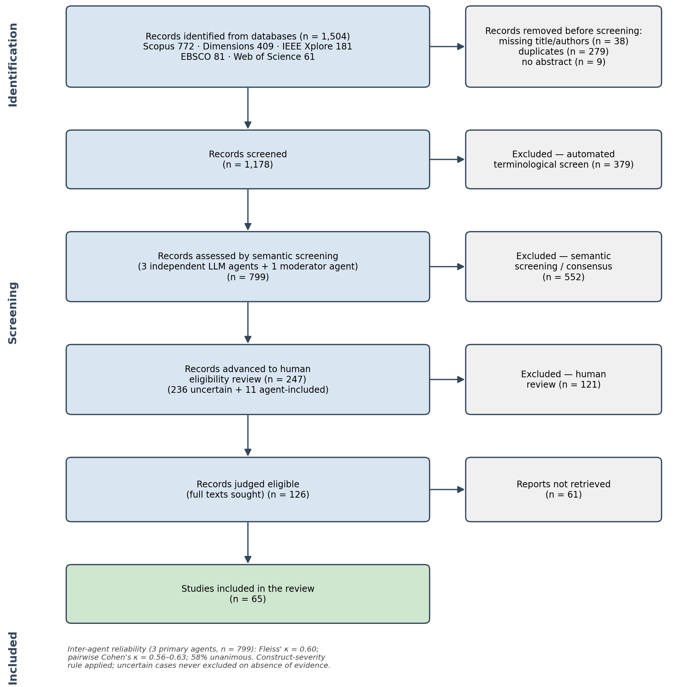

# Methods

## Protocol and reporting

This review was designed and is reported following the PRISMA 2020 statement and,
for the conduct of a systematic literature review in engineering education
specifically, the methodological guidance synthesised by @borrego_systematic_2014.
A pre-specified protocol (Review Protocol v2) fixed the research question,
eligibility criteria, search strategy, screening procedure and analysis plan
before screening began. The review was not prospectively registered; registration
in PROSPERO or OSF is recommended before any update. The protocol, extraction
schemas and analysis code are openly archived, so the design is auditable in full. The review question, framed with the
Population–Concept–Context (PCC) scheme, asked how digital twins (DTs) are
designed, implemented and evaluated in higher-education engineering and STEM
settings. It was decomposed into four objectives: technological architectures and
deployment environments (O1); pedagogical strategies and Industry 4.0/5.0
competencies (O2); empirical evidence of learning outcomes (O3); and institutional
benefits and critical barriers (O4).

## Eligibility criteria

The population and context were university-level engineering or STEM students and
instructors in courses, laboratories, training or assessment; the concept was the
educational implementation, deployment, evaluation or use of a DT. The construct
was defined canonically and applied with a deliberately conservative severity rule
to guard against semantic drift: a DT is a virtual representation of a *specific*
physical asset, bidirectionally and continuously coupled to it, so that state
changes propagate physical→virtual *and* virtual→physical. Standalone simulations
or numerical models, virtual or remote laboratories, VR/AR/XR, the metaverse,
serious games, generic CPS/IoT testbeds, digital models (no automatic data
exchange) and digital shadows (one-way coupling) were treated as near-misses and
qualified only when the bidirectional coupling was explicit. Studies that claimed
a "digital twin" with partial or unstated synchronisation were coded *uncertain*
rather than excluded, under an authoritative precedence rule whereby absence of
confirming evidence is never grounds for exclusion.

A hard document-type gate was applied before thematic relevance: empirical journal
articles, full conference papers and early-access empirical articles were
eligible, whereas reviews of any kind, surveys, editorials, opinion pieces,
abstracts, posters and keynote summaries were ineligible. No language restriction
was imposed; the retained corpus includes English, Spanish and Russian.

## Information sources and search

Five bibliographic databases were searched: Scopus, Web of Science, IEEE Xplore,
EBSCO and Dimensions. The searches were last run on 14 May 2026 (Web of
Science, IEEE Xplore) and 15 May 2026 (Scopus, EBSCO, Dimensions). The core string combined the construct with an education
block — ("digital twin\*" OR "educational digital twin\*") AND ("engineering
education" OR "engineering training" OR "technical education" OR "STEM
education") — adapted to each database's syntax. The choice of a compact,
precision-oriented string rests on a documented sensitivity analysis of the
search chain. In Scopus, the construct alone ("digital twin\*") returned 20,917
records, and lengthening the construct disjunction with "digital-twin\*" or
"educational digital twin\*" did not enlarge this domain; conjoining the
education block reduced the set to 192–193 records, whereas appending a long
technology disjunction (laboratory, IoT, CPS, mechatronics, automation,
telecommunications, embedded and cyber-physical systems) only narrowed recall
further, to 159, without surfacing additional relevant work. Progressively
trimming the education terms moved the yield monotonically between 141
("engineering education" alone) and 193 (the full education disjunction). These
runs confirmed two design decisions: the term "digital twin\*" alone retrieves
the same domain as longer construct disjunctions, and the education block — not a
long technology disjunction — is the effective constraint. The string was
therefore fixed to favour precision over an unfocused expansion of recall.

The searches returned 1,504 raw records (Scopus 772, Dimensions 409, IEEE 181,
EBSCO 81, Web of Science 61). After removing 38 records lacking a title or
authors, 1,466 records entered deduplication. Matching on DOI (232) and fuzzy
title (47) removed 279 duplicates, yielding 1,187 unique records; a further 9
without an abstract were set aside, leaving 1,178 records for screening.

## Study selection

Selection proceeded in three stages, summarised in the PRISMA 2020 flow diagram
(Figure 1). First, an automated terminological screen required both a DT block
and an engineering-education block to be present in the title, abstract or
keywords, with a keyword-based rescue for records carrying the terms only in
author or index keywords. This retained 799 records (206 by full field match and
593 by keyword rescue) and set aside 379 on terminological grounds. Second, the
799 records underwent semantic screening by a panel of three independent large
language model (LLM) reviewers. To avoid one-dimensional judgments, the three
reviewers shared a single base model (DeepSeek-V4-Flash, a non-reasoning
configuration at temperature 0) but were instantiated with three complementary
expert *roles*: a Principal Investigator (judging the genuine intersection of all
required concepts), a Research Methodologist (document type, empirical design and
analytic purpose), and a Domain Expert (construct centrality and population/context
authenticity). Each role applied the *same* pre-specified, decidable criterion
set—the canonical construct definition with its strict / moderate / near-miss
severity mapping, the hard document-type gate, the positive include/exclude tests,
and an authoritative uncertainty-precedence rule (absence of confirming evidence is
coded *uncertain*, never *exclude*)—but weighted it through its professional lens;
the role defines the lens, not the scope. Each reviewer returned, for every record,
an independent decision (include, exclude or uncertain), a confidence score, the
governing criterion, and a verbatim evidence span. Running the base model at
temperature 0 with cached calls makes the procedure *reproducible*—re-running
yields identical outputs—but it does not make the three reviewers identical: their
differing role lenses produce genuine, criterion-grounded disagreement on
borderline records, which is the intended behaviour of a review panel rather than
stochastic noise. Aggregation followed a strict-unanimity rule: a record was
auto-classified only when all three reviewers agreed; any split, or any "uncertain"
vote, was escalated to a fourth moderator agent (same model, independent prompt and
seed) that read the three rationales and, absent a defensible resolution, deferred
the record to human review.

Agreement among the three primary reviewers was substantial: they were unanimous on
466 of the 799 records (58%), the moderator resolved a further 96 split cases (5 to
include, 91 to exclude), and inter-agent reliability was Fleiss' κ = 0.60 across the
three categories, with pairwise Cohen's κ between 0.56 and 0.63. This κ quantifies
*agreement among the role lenses, not the validity of the screen*: it is expected to
fall below unity precisely because the panel is designed to disagree on genuinely
borderline records, and because the uncertainty-precedence rule routes ambiguous
records to the "uncertain" category—depressing nominal agreement—rather than risking
a false exclusion. The decision criteria were anchored to twelve expert-authored
calibration cases (four include, four exclude, four uncertain) spanning the
construct-versus-near-miss boundary. Validity against a human standard was secured at
the inclusion margin—every record the panel did not unanimously exclude (247) was
adjudicated by a human—while residual false-negative risk in the unanimously-excluded
zone is bounded by a documented, reproducible audit (a blind random sample of
consensus-excluded records re-adjudicated by a human from title, abstract and
keywords, with the models' rationales withheld to prevent anchoring); the audit
script is released in the repository to be completed before any update. The agent
prompts, scores and per-record outputs are provided as supplementary material and in
the public repository. Third, a human
review of the 247 records that the agents flagged as include (11) or uncertain
(236) confirmed 126 as eligible. Full texts could be
obtained for 65 of these; the remaining 61 could not be retrieved, and the
synthesis proceeds on the 65 retrievable studies.

{width=5in}

**Figure 1.** PRISMA 2020 flow diagram of identification, screening and inclusion. Title/abstract screening combined an automated terminological screen with semantic screening by three independent large language model (LLM) agents and a fourth moderator agent (inter-agent Fleiss' κ = 0.60).

## Data extraction

Full texts were converted from PDF with the Marker pipeline to preserve textual
fidelity, and extraction followed a theme-conditional activation principle: each
study activated only the extraction templates of the themes in which it had been
inductively coded, with the remaining variables left as not-applicable. This
reduced extraction load, kept the evidence pertinent, and allowed per-theme
reporting rates to be computed. Every critical variable used a controlled
vocabulary — NR (not reported), NA (not applicable) and UNCERTAIN — and double
verification, recording the extracted value together with a verbatim supporting
quotation and its location, so that each datum is traceable to its source and
independently auditable.

## Thematic analysis and synthesis

An inductive thematic analysis — conducted with three frontier LLMs (ChatGPT 5.5,
Gemini 3.1 Pro and Claude Opus 4.7), whose independent codings were iteratively
cross-fed and refined through successive rounds of author review to converge on a
scheme granular enough to be exhaustive yet parsimonious enough to remain
tractable — produced eight themes: practical infrastructure (T1), enabling
architectures (T2), AI convergence (T3), Industry 4.0/5.0 competencies (T4),
pedagogical design (T5), empirical evidence (T6), institutional value (T7) and
barriers (T8). The three models' outputs are included in the public repository. These were mapped N:M onto the four objectives
through a traceability matrix (O1 = T1+T2+T3; O2 = T4+T5; O3 = T6; O4 = T7+T8), so
that a single study could contribute to several themes and objectives.

The synthesis was structured and narrative, without meta-analysis — a decision
justified by the methodological and outcome heterogeneity of the corpus. Because
the review's principal inferences depend on the strength of the primary evidence,
the methodological quality of each empirical study was formally appraised rather
than assumed. Because no single instrument captures the rigour markers that the
engineering-education research community has long argued distinguish trustworthy
from anecdotal evidence [@streveler_conducting_2006], we used a transparent,
purpose-built composite rather than importing a clinical appraisal tool wholesale:
each empirical study scored 0–6 on five additive markers—design rigour,
comparator, inferential statistics, effect size and declared validity
threats—chosen because they are the dimensions most consistently flagged in that
methodological literature and are extractable from the reporting actually present
in the corpus. The composite is deliberately simple and its banding is tested for
robustness rather than treated as exact (below). Analysis proceeded in three
principal layers: per-theme descriptive profiling with explicit
reporting rates (Layer 1); aggregation by objective, including the 0–6
evidence-quality composite over empirical studies
(Layer 2); and theme co-occurrence and configuration analysis (Layer 3). These
were complemented by an exploratory relational layer comprising an
attribute-association network (φ coefficients with Fisher exact tests and
non-parametric bootstrap 95% confidence intervals, B = 5,000), a multiple
correspondence analysis embedding, and a capability-by-evidence gap map. The
robustness of the evidence bands was tested with a threshold-sensitivity analysis
and bootstrap intervals, and the full pipeline is scripted end-to-end for
reproducibility.

